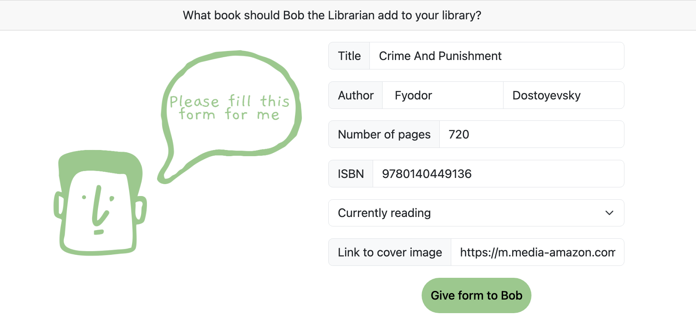
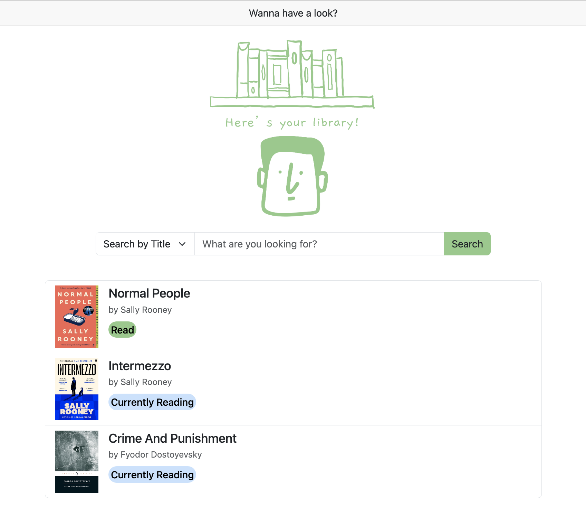
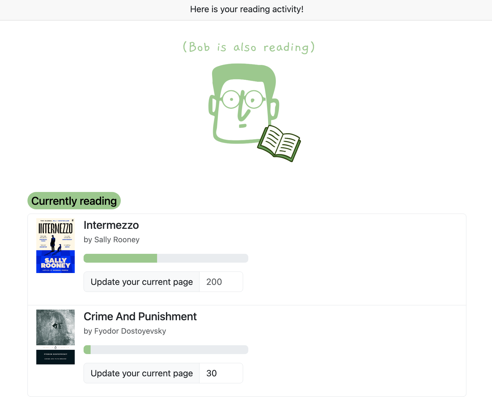
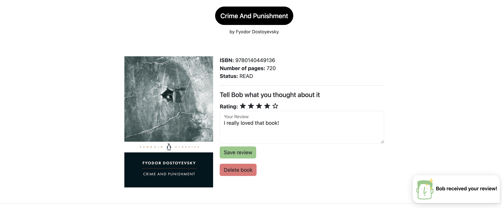

# 📚 Bob's Library

Welcome to Bob's Library!


This is a personal book tracking app to manage your library, track progress of your current reads, add ratings, and write reviews.

## Features
- Add, search, and delete books
- List your current reads and track your progress
- Rate and review books that you've read
- Search by book title or ISBN
- Check book details

## Tech Stack
**Frontend:** Angular 21, Bootstrap

**Backend:** Java, Spring Boot, Hibernate, MySQL

## Getting Started

### Backend
```bash
cd backend
cd bobsLibrary
./mvnw spring-boot:run
```

### Frontend
```bash
cd frontend
cd myLibrary
npm start
```

## Example of a scenario

#### Add ‘Crime and Punishment’ to your library


#### Let's look at your library
‘Crime and Punishment’ was successfully added to your library. For now, the books appear in the order of the date they were added, but a future update will allow you to filter them however you want.


#### Here is your reading activity
You are currently reading two books. You can update your current page and the progress bar will give you an idea of how much you have read so far.


#### Add a rating and write a review
Let's imagine that you have finally read ‘Crime and Punishment’. You can now add a review and update it whenever you want. Now, Bob the Librarian knows if you enjoyed the book. He loves recommandations.



## Future updates
This is an ongoing project. Here's what's coming:
- Modify books and their reading status whenever you want
- Add pagination
- Search by author
- Filter by reading status, date added, etc.
- And more!